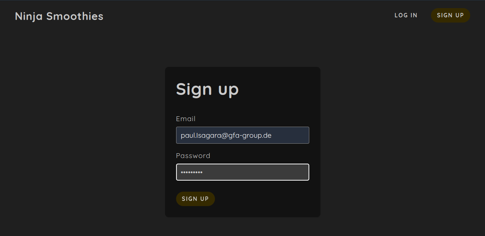
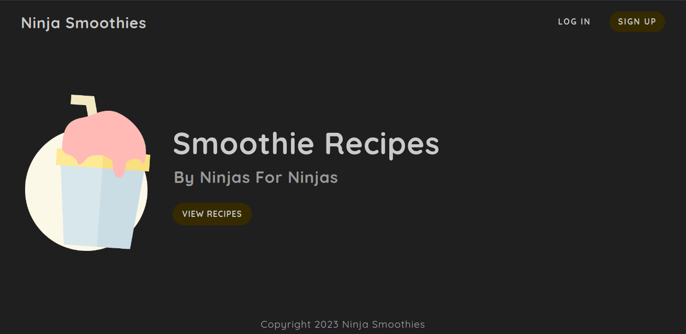
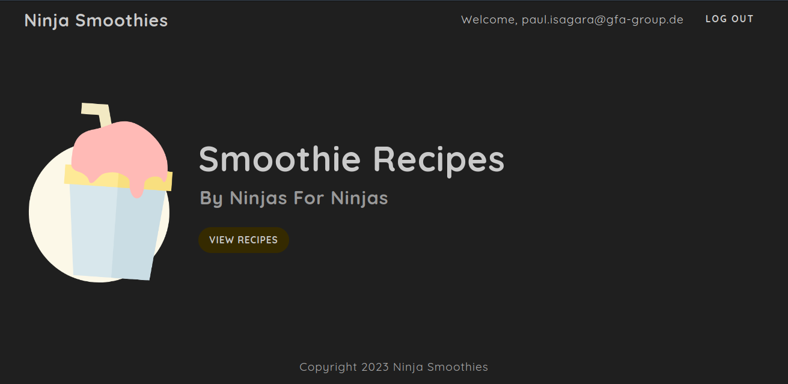
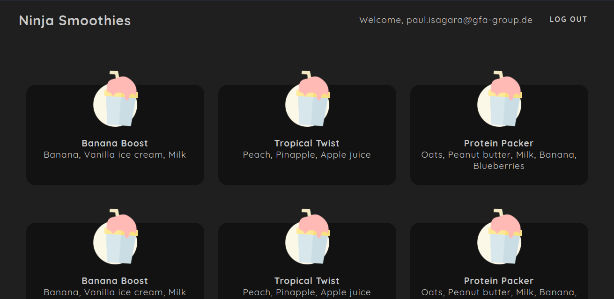

# Smoothies-authentication-service

<p align="center">
    
</p>

## Description :book:

This is a clone project implementation of an authentication service using Json Web Tokens(JWT). The project explores various authentication and design principles like; Password Hashing, Data Validation using Mongoose, use of Hooks, Route Protection and Conditional Rendering using tools; Node.js, Express, MongoDB, Mongoose, EJS JavaScript Templating Language. 

Packages used include but not limited to; bcrypt, jwt, cookie_Parser and validator

## Get Started and Installation Guide :couple:

* Fork the repository to download a local copy of this project onto your local machine.
* Run this command below in your terminal to install all project dependencies
```shell
raymond@raymond-ThinkPad-T480:~/auth_project$ npm install
....
```
* Run this command next to start the server
```shell
raymond@raymond-ThinkPad-T480:~/auth_project$ nodemon app.js
....
```

* NB: Don't forget to set up your Mongo DB cluster and connect to your database by modifying the connection string contained in file `models/users.js`

## Usage :open_file_folder:
<p align="center">
    
</p>
* User route ```http://127.0.0.1:3000/``` to access the home-page of the project
<p align="center">
    
</p>
* Sign up with your desired `email` and `password`
<p align="center">
    
</p>
* You will be redirected to the Home Page
<p align="center">
    
</p>
* Access the smoothies recipies page by clicking on the `view recipies` button
* To Log out simply click on the log out button.

## Authors and acknowledgment :school:
* Raymond Lukwago - [Github](https://github.com/lukwagoraymond) / [Twitter](https://twitter.com/lukwagoraymond)  
* Acknowledgement to Net Ninja for the tutor guidance - [YouTube](https://www.youtube.com/playlist?list=PL4cUxeGkcC9iqqESP8335DA5cRFp8loyp)

## Bugs :bug:
- Login Front End still displays Error text on form element for email

## License :warning:
Public Domain. No copy write protection.
